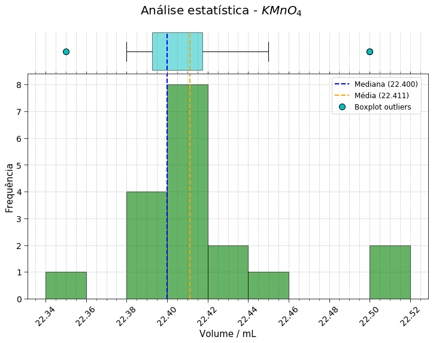

# Análise estatística de uma prática de química

Repositório com as análises estatísticas da prática de leitura de escala de
buretas da disciplina de Química Geral I do IFRJ _campus_ Rio de Janeiro.

Para as análises, foram utilizadas as bibliotecas [Pandas](https://pandas.pydata.org/)
e [Matplotlib](https://matplotlib.org/) da linguagem [Python](https://www.python.org/).

O objetivo é dar as primeiras noções de dados experimentais, estatística e
algarismos significativos aos alunos.

A análise pode facilmente ser aplicada a outras práticas e contextos onde há
dispersão de valores oriundos de leituras de escalas.

## Licença

MIT, veja [LICENSE](LICENSE)

## Citação

Caso deseje citar o repositório considere fazer da seguinte forma:

F. L. S. Bustamante, *Análise estatística de uma prática de química com Python*, 2019 -
Disponível em: https://github.com/chicolucio/estatistica-pratica-buretas